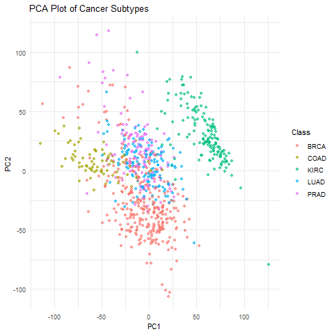
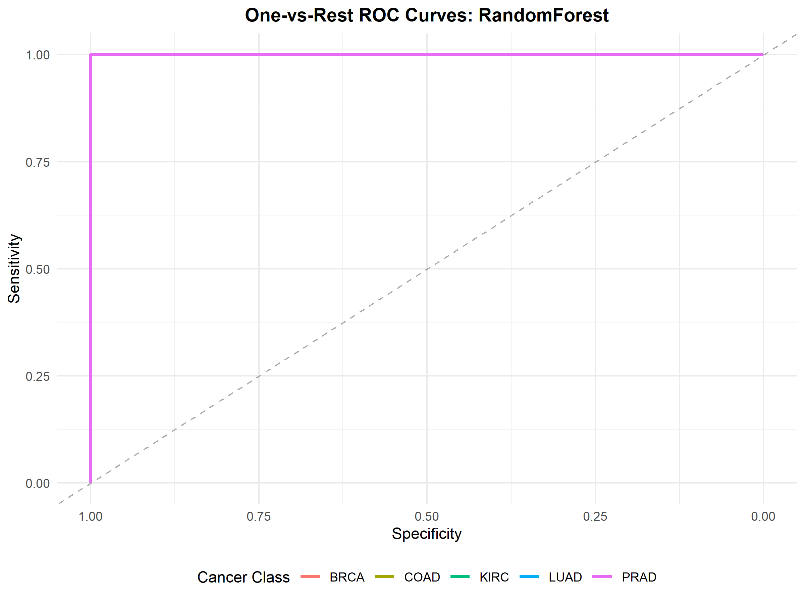

# Multi-Cancer Classification using RNA-Seq Gene Expression


## Overview

This project implements a statistical learning pipeline for **classifying multiple cancer types using RNA-seq gene expression data**.
Gene expression datasets are typically **high-dimensional**, with thousands of genes but relatively few samples. This project explores how classical statistical learning methods can be applied to such datasets for cancer subtype classification.

The pipeline includes:

* Data preprocessing and normalization
* Exploratory dimensionality reduction
* Unsupervised clustering analysis
* Supervised machine learning models
* Model evaluation using ROC curves and performance metrics

The analysis is implemented in **R** using a modular and reproducible pipeline structure.

---
## Key Highlights

• End-to-end machine learning pipeline for RNA-seq cancer classification  
• High-dimensional gene expression analysis  
• Comparison of multiple supervised learning algorithms  
• PCA-based exploratory clustering analysis  
• Fully reproducible pipeline using renv  
• Modular R codebase with automated tests
---

## Project Motivation

RNA-seq gene expression datasets are widely used in computational biology to study cancer mechanisms and identify disease subtypes.
However, such datasets present unique challenges:

* Very high dimensionality (thousands of genes)
* Small sample sizes
* High levels of noise

This project investigates how statistical learning methods can be used to build predictive models while exploring the structure of gene expression data.

---

## Methods Implemented

The following machine learning algorithms were implemented and compared:

* **K-Nearest Neighbors (KNN)**
* **Support Vector Machine (SVM)**
* **Random Forest**
* **Gaussian Discriminant Analysis (GDA)**

Exploratory analysis was performed using **Principal Component Analysis (PCA)** to visualize clustering patterns in the gene expression data.

---

## Project Pipeline

The project pipeline consists of four major stages:

### 1. Data Preprocessing

* Load gene expression dataset
* Normalize expression values
* Filter low-variance genes
* Prepare analysis dataset

### 2. Exploratory Analysis

* Principal Component Analysis (PCA)
* Visualization of clustering structure
* Scree plot analysis

### 3. Model Training

* Train-test data splitting
* Model training for multiple algorithms
* Hyperparameter configuration

### 4. Model Evaluation

* Prediction on test dataset
* ROC curve analysis
* Model comparison

---

## Repository Structure

```
msc-multicancer-rnaseq
│
├── R/
│   ├── data_loaders.R
│   ├── preprocessing.R
│   ├── feature_selection.R
│   ├── evaluation.R
│   └── plotting.R
│
├── scripts/
│   ├── 01_global_clustering.R
│   ├── 02_create_splits.R
│   ├── 03_supervised_training.R
│   └── 04_evaluate_models.R
│
├── results/
│   ├── figures/
│   └── tables/
│
├── reports/
│   └── dissertation.pdf
│
├── tests/
│   └── testthat/
│
├── run_pipeline.R
├── setup_project.R
├── config.yml
├── requirements.R
└── renv.lock
```

---

## Pipeline Scripts

The analysis pipeline is implemented through sequential scripts:

**scripts/01_global_clustering.R**

Performs exploratory PCA analysis and clustering visualization.

**scripts/02_create_splits.R**

Creates training and testing datasets.

**scripts/03_supervised_training.R**

Trains machine learning models including KNN, SVM, Random Forest, and GDA.

**scripts/04_evaluate_models.R**

Evaluates models and generates ROC curves and performance metrics.

---

## Example Results

### PCA Clustering

The PCA analysis provides a low-dimensional visualization of gene expression patterns across cancer samples.



### ROC Curve Example

ROC curves are used to compare predictive performance across models.



---

## Dataset

The gene expression dataset that has been utilized in this study was obtained from 
the UCI Machine Learning Repository (Fiorini, 2016). This dataset, titled "gene 
expression cancer RNA-Seq”, comprises of RNA sequencing (RNA-Seq) measurements 
of 20,531 different gene expression for 801 samples across 5 types of cancer namely:
Breast (BRAC), Colorectal (COAD), Kidney (KIRC), Lung (LUAD), Prostate (PRAD);
measured by illumina HiSeq 2000 next generation sequencing techniques. The data is 
publicly available under the Creative Commons CC0 license and can be accessed via 
the provided DOI: https://doi.org/10.24432/C5R88H

Preprocessing steps include:

* normalization
* filtering low-variance genes
* dimensionality reduction

---

## Running the Pipeline

Clone the repository:

```
git clone https://github.com/Dipmalya-Roy/msc-multicancer-rnaseq.git
```

Navigate to the project directory:

```
cd msc-multicancer-rnaseq
```

Run the full analysis pipeline:

```
Rscript run_pipeline.R
```

This will execute the complete workflow including preprocessing, model training, and evaluation.

---

## Technologies Used

* **R**
* **tidyverse**
* **caret**
* **randomForest**
* **glmnet**
* **ggplot2**
* **testthat**
* **renv** (for reproducible environments)

---

## Testing

Unit tests are implemented using the **testthat** framework to verify:

* correctness of key functions
* prevention of data leakage between training and test sets
* validity of mathematical computations

---

## Reproducibility

The project uses **renv** to manage R package dependencies and ensure reproducibility of the analysis environment.

---
## Dissertation Report

The full MSc dissertation describing the methodology, experimental design, and results of this project is available here:

📄 [Read the dissertation](reports/dissertation.pdf)

## Author

Dipmalya Roy
MSc Statistics
St. Xavier’s University, Kolkata

---

## License

This project is provided for academic and research purposes.


